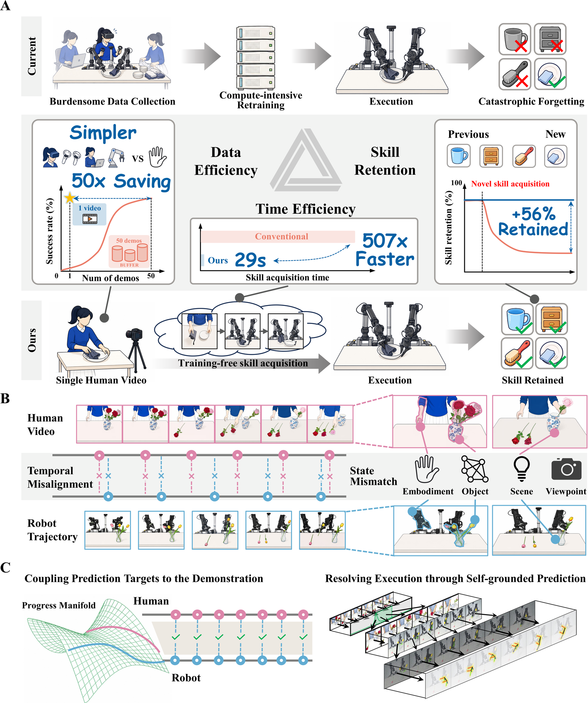
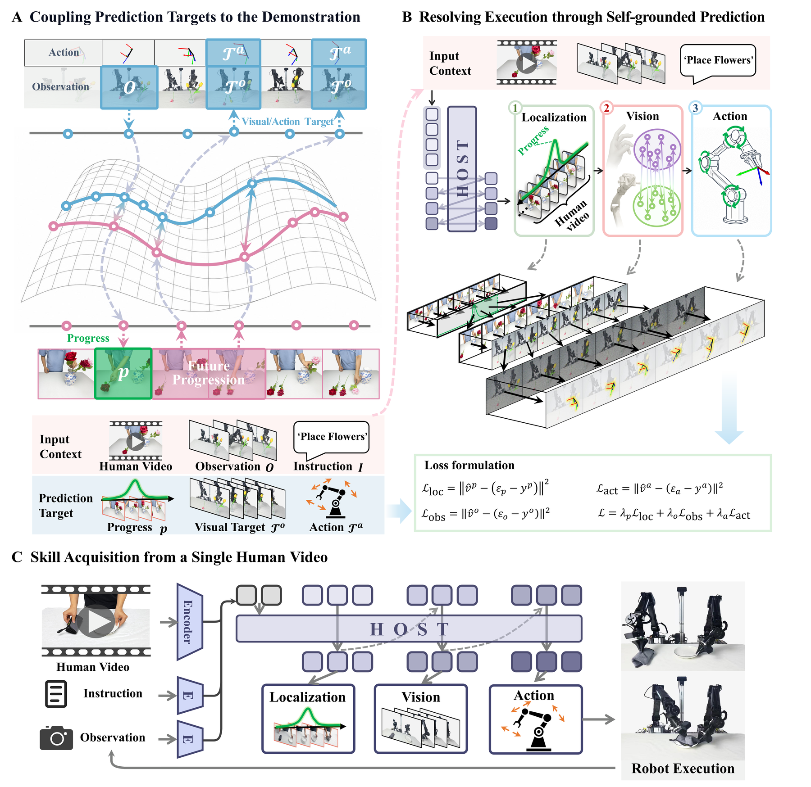

# Robots Acquire Manipulation Skills in Seconds from a Single Human Video

<p align="center">
  <b>HOST: Human-to-robot One-Shot Skill AcquisiTion</b>
</p>

<p align="center">
  <a href="https://arxiv.org/abs/2607.20033">arXiv</a>
  ·
  <a href="https://huggingface.co/papers/2607.20033">Hugging Face</a>
  ·
  <a href="https://host-site.host-robotics.workers.dev/">Project Website</a>
  ·
  <a href="#getting-started">Getting Started</a>
  ·
  <a href="#data-format">Data Format</a>
  ·
  <a href="#citation">Citation</a>
</p>

<p align="center">
  <a href="https://arxiv.org/abs/2607.20033">
    
  </a>
  <a href="https://huggingface.co/papers/2607.20033">
    
  </a>
  <a href="https://host-site.host-robotics.workers.dev/">
    
  </a>
  <a href="https://www.python.org/">
    
  </a>
  <a href="https://pytorch.org/">
    
  </a>
</p>

This repository is the official implementation of our paper, **“Robots Acquire Manipulation
Skills in Seconds from a Single Human Video.”** The paper introduces **HOST
(Human-to-robot One-Shot Skill AcquisiTion)**, a framework that enables a robot to acquire a
previously unseen manipulation skill at inference time from **one human demonstration video**,
without task-specific parameter updates.

Instead of mapping the entire video directly to actions, HOST:

1. couples each prediction target to the demonstration on a shared task-progress manifold; and
2. resolves execution through a self-grounded cascade that localizes progress, predicts the
   robot's own future observations, and then derives actions.

The resulting policy actively follows the demonstrated procedure while adapting it to the robot's
embodiment, viewpoint, and deployment scene. Because skill acquisition does not modify the policy
weights, previously mastered skills are retained.

<p align="center">
  
</p>

## Highlights

- **Inference-time skill acquisition:** one human video, no fine-tuning, and no parameter update.
- **Fast acquisition:** 29 seconds per novel skill on average, including recording the
  demonstration.
- **Broad real-robot evaluation:** 62% average success across 50 novel manipulation tasks.
- **Data and time efficiency:** 50 times fewer demonstrations and 507 times faster acquisition
  than the strongest task-specific fine-tuning baseline evaluated in the paper.
- **Skill retention:** new skills are supplied through external video context rather than written
  into the shared policy weights.
- **Robust execution:** evaluated under lighting changes, unseen objects, scene replacement, and
  human disturbances during execution.

The numbers above are results reported in the paper.

## Method

HOST addresses two structural mismatches between human demonstration and robot execution.

**1. Target coupling.** Human and robot trajectories progress at different speeds. A
Qwen3-VL-Embedding-8B alignment model, trained with temporal cycle consistency and Smooth DTW,
maps same-task trajectories to a shared task-progress manifold. The recovered correspondence
couples each robot prediction target to the upcoming progression of the demonstration rather than
to a fixed clock-time offset.

**2. Self-grounded prediction.** A dual-expert autoregressive diffusion model first localizes the
robot's current progress in the demonstration, then predicts the corresponding future in the
robot's own visual domain, and finally predicts an action chunk from that future. The video expert
is initialized from Wan2.2-TI2V-5B; the action expert and video expert communicate through shared
attention in a Mixture-of-Transformers architecture.

<p align="center">
  
</p>

## Codebase overview

The repository contains the released model-training and offline data-processing components of
HOST:

| Component | Purpose | Location |
|---|---|---|
| Dataset preprocessing | Episode schema and same-task grouping | [`data_preprocessing/`](./data_preprocessing/) |
| Target coupling | Progress-alignment training and evaluation | [`alignment/`](./alignment/) |
| Progress conversion | Convert DTW records into progress targets | [`coupling/`](./coupling/) |
| Self-grounded prediction | Policy training and recorded-data evaluation | [`policy_training/`](./policy_training/) |

## Repository layout

The four top-level modules follow the training-data flow:

```text
HOST/
├── data_preprocessing/   # Define the dataset contract and group same-task episodes
├── alignment/            # Learn temporal correspondence with TCC + Smooth DTW
├── coupling/             # Convert alignment records into per-frame progress targets
└── policy_training/      # Train and evaluate the self-grounded diffusion policy
```

```text
raw episodes
    │
    ├─ data_preprocessing ──> task_paths.json
    │                              │
    └──────────────────────────────v
                              alignment
                                  │
                                  v
                    high_loss_samples_*.jsonl
                                  │
                                  v
                              coupling ──> info_dtw.json
                                                  │
                                                  v
                                         policy_training
```

Start with the module that matches your goal:

| Goal | Documentation |
|---|---|
| Convert a dataset to the expected episode format | [`data_preprocessing/README.md`](./data_preprocessing/README.md) |
| Train or evaluate the progress-alignment model | [`alignment/README.md`](./alignment/README.md) |
| Materialize aligned progress labels | [`coupling/README.md`](./coupling/README.md) |
| Train or evaluate the policy | [`policy_training/README.md`](./policy_training/README.md) |
| Read the policy documentation in Chinese | [`policy_training/README_zh.md`](./policy_training/README_zh.md) |

## Getting started

### 1. Clone the repository

```bash
git clone https://github.com/CGuangyan-BIT/HOST.git
cd HOST
```

### 2. Set up the environments

HOST uses two separate Conda environments because alignment and policy training use different
large-model stacks and PyTorch versions.

| Module | Conda environment | Dependency definition | Main framework |
|---|---|---|---|
| `alignment/` | `HOST_Alignment` | [`alignment/environment.yml`](./alignment/environment.yml) | PyTorch 2.4.0 + CUDA 12.4 |
| `policy_training/` | `HOST_Policy` | [`policy_training/environment.yml`](./policy_training/environment.yml) | PyTorch 2.6.0 + CUDA 12.4 |

There is no single root-level `requirements.txt`. The complete alignment environment is recorded
in `alignment/environment.yml`, exported from the local alignment environment. The complete policy
environment is recorded in `policy_training/environment.yml`, exported from the local `lingbot`
environment. Policy package dependencies are also declared in
[`policy_training/pyproject.toml`](./policy_training/pyproject.toml). Keeping the two Conda
definitions separate preserves their respective PyTorch stacks.

Create the alignment environment from its complete Conda specification:

```bash
conda env create -f alignment/environment.yml
conda activate HOST_Alignment
```

Create the policy-training environment from the local `lingbot` export, then install the repository
package in editable mode without resolving a second dependency set:

```bash
conda env create -f policy_training/environment.yml
conda activate HOST_Policy
pip install -e ./policy_training --no-deps
```

### 3. Prepare episode data

Arrange robot episodes using the [shared dataset schema](./data_preprocessing/README.md#2-dataset-format),
then group episodes that execute the same task:

```bash
cd data_preprocessing

python build_task_dictionary.py \
  --input_dir /path/to/episodes \
  --output_path ./output/my_dataset.hdf5 \
  --dataset_name my_dataset \
  --clear

python write_task_paths.py \
  --hdf5_path ./output/my_dataset.hdf5
```

This writes a `task_paths.json` file into each episode directory. It is used to sample paired
same-task trajectories during alignment and policy training.

### 4. Train the alignment model

```bash
cd ../alignment
conda activate HOST_Alignment
```

Pass your JSON episode list through `VIDEO_PATHS`, then launch the DeepSpeed ZeRO-3 entrypoint:

```bash
VIDEO_PATHS=/path/to/video_paths.json bash train_scripts/run_ds.sh
```

For evaluation or a custom launcher, inspect all supported arguments with:

```bash
python train.py --help
python evaluate_v2.py --help
```

### 5. Build coupled progress targets

Alignment runs write `high_loss_samples_*.jsonl` records. Convert them into the `info_dtw.json`
files consumed by policy training:

```bash
cd ../coupling/progress_alignment

python build_progress_info.py \
  --log_file /path/to/alignment_run/logs
```

The converter filters unreliable or non-causal alignments before writing per-frame normalized
progress values.

### 6. Train the self-grounded policy

```bash
cd ../../policy_training
conda activate HOST_Policy
```

Prepare the Wan2.2-derived ActionDiT initialization:

```bash
mkdir -p checkpoints
export DIFFSYNTH_MODEL_BASE_PATH="$(pwd)/checkpoints"

python scripts/preprocess_action_dit_backbone.py \
  --model-config configs/model/self_grounded_predictor_joint_cross_attn_ve.yaml \
  --output checkpoints/ActionDiT_linear_interp_Wan22_alphascale_1024hdim.pt \
  --device cuda \
  --dtype bfloat16
```

Update `configs/data/custom_cross_all.yaml` with your dataset, camera mapping, action
normalization, image size, and frame rate. Precompute text embeddings and start training:

```bash
python scripts/precompute_text_embeds.py \
  task=real_joint_2cam_224_1e-4_pac_headwise_ncp_ve

bash scripts/run_train.sh
```

The launch script accepts Hydra overrides, for example:

```bash
bash scripts/run_train.sh batch_size=4
```

### 7. Run recorded-data evaluation

After setting the checkpoint, normalization-statistics, and dataset paths in the evaluation
launcher:

```bash
bash scripts/eval_openloop.sh
```

This evaluates action prediction on recorded episodes. It does **not** command a live robot.

## Data format

Both large-model modules share one episode format. A typical policy-training episode contains:

```text
episode_001/
├── episode_001.json     # Synchronized robot state and action trajectory
├── instruction.txt      # Task instruction
├── instruction.pt       # Cached UMT5-XXL embedding
├── task_paths.json      # Other episodes of the same task
├── info_dtw.json        # Optional per-frame aligned progress produced by coupling/
├── images/              # Third-person RGB frames, or an equivalent video file
└── gripper_images/      # Additional camera view(s), when used
```

A dataset-level episode-list JSON, camera mapping, and action-normalization mapping are also
required. Field definitions, path conventions, examples, and the differences between alignment
and policy training are documented in
[`data_preprocessing/README.md`](./data_preprocessing/README.md).

## Compute requirements

The paper-scale experiments used 64 GPUs for both alignment and policy training:

- alignment: 10,000 steps, bfloat16, DeepSpeed ZeRO-3;
- policy Stage 1: 500,000 steps on 193,462 robot trajectories from 229 tasks; and
- policy Stage 2: 100,000 steps on 5,847 human-video/robot-trajectory pairs.

The shipped launchers are configurable templates and do not automatically reproduce this full
training scale.

## Acknowledgements

The self-grounded policy implementation is built on
[Fast-WAM](https://arxiv.org/abs/2603.16666). HOST also builds on
[Qwen3-VL-Embedding-8B](https://huggingface.co/Qwen/Qwen3-VL-Embedding-8B),
[Wan2.2](https://github.com/Wan-Video/Wan2.2),
[DINOv2](https://github.com/facebookresearch/dinov2), and
[SigLIP](https://huggingface.co/docs/transformers/model_doc/siglip). We thank the authors of these
projects for releasing their work.

## Citation

If you find HOST useful in your research, please cite:

```bibtex
@article{chen2026host,
  title   = {Robots acquire manipulation skills in seconds from a single human video},
  author  = {Chen, Guangyan and Wang, Meiling and Cui, Te and Zhou, Zichen and others},
  year    = {2026}
}
```

## License

The self-grounded policy module includes the
[`policy_training/LICENSE`](./policy_training/LICENSE) inherited from its Fast-WAM foundation.
This snapshot does not yet include a repository-wide license file. Please also follow the license
terms of the external models and codebases listed above.
